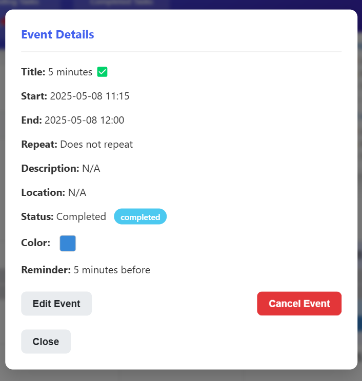
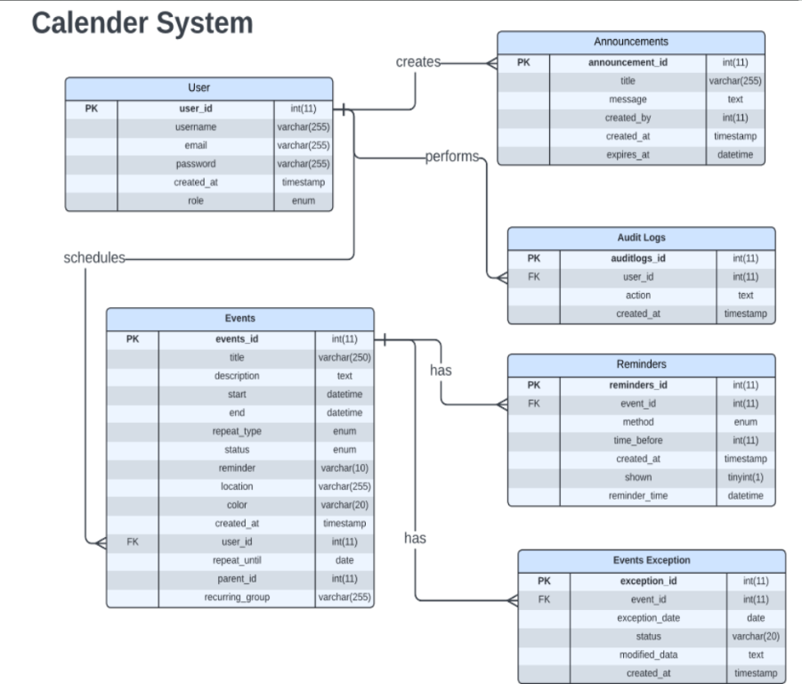

# myCalendar – Web-Based Scheduling System

A powerful, flexible calendar and event manager built with **PHP, HTML, CSS, and JavaScript**, featuring recurring events, drag-and-drop scheduling, real-time reminders, and email notifications. Designed to help users manage tasks and stay productive through an intuitive, personalized interface.

---

## Table of Contents

- [Overview](#-overview)
- [Objectives](#-objectives)
- [Tech Stack](#-tech-stack)
- [System Features](#-system-features)
- [Screenshots](#-screenshots)
- [ERD & Flowchart](#-erd--flowchart)
- [How to Run](#-how-to-run)
- [Project Members](#-credits)
- [Project Documentation](#project-documentation)
- [License](#-license)

---

## Overview

**myCalendar** is a simple yet powerful calendar platform built for scheduling personal tasks and events. It features role-based access (Admin & User), recurring events, reminders via email/system notifications, and status tracking — all accessible from an intuitive calendar dashboard.

---

## Objectives

- Provide a user-friendly calendar interface for event creation and tracking  
- Allow **color-coded** event customization for clarity  
- Support **recurring event logic** (edit/cancel all or just one)  
- Enable full control: drag to reschedule, update status, delete  
- Send **custom reminders** and notifications via system + email  
- Deliver **extra alerts** for events with 5-minute reminders  
- Admin: monitor events, post announcements, manage user roles  
- Maintain accountability through audit logs and activity tracking  

---

## Tech Stack

| Tech        | Usage                        |
|-------------|------------------------------|
| PHP         | Server-side scripting         |
| MySQL       | Database                      |
| HTML/CSS    | Frontend structure & styles   |
| JavaScript  | Client-side logic, interactivity |
| PHPMailer   | Email reminders               |
| Bootstrap   | UI styling                    |

## System Features

### User Side

- Register & login securely  
- Create single or recurring events  
- Customize event color, time, and description  
- Edit recurring events (this instance or all)  
- Set reminders (custom or 5-mins before event)  
- Email + in-app notifications  
- Status tracking (Completed, Pending, Cancelled)  
- Export events to Excel  
- Drag-and-drop calendar editing

---

### Admin Side

- Manage user roles  
- Post announcements  
- View user events  
- Access audit logs  
- Monitor changes & actions for accountability

---

## Screenshots

Click to view screenshots

  
    

  

  
    

  

  
  

   
  

---

## ERD & Flowchart

Click to view ERD & System Flow

 

---

## How to Run

1. Clone or download this repository  
2. Import the SQL file into your MySQL server  
3. Update database connection settings in `db_connect.php`  
4. Open the project in XAMPP / MAMP or any local server  
5. Navigate to `localhost/myCalendar`

---

## Project Members

- Danah Paris
- Christian Paul Mendoza
- Eloisa Creencia
- Theresa Valiente

---
## Project Documentation
For more info,[📄 View the Full Documentation (PDF)](myCalendar-documentation.pdf) and [📖User Manual](User-Manual.pdf)! 

## License

This project is built for educational purposes.  
You're welcome to explore or modify — just give credit where it's due.

